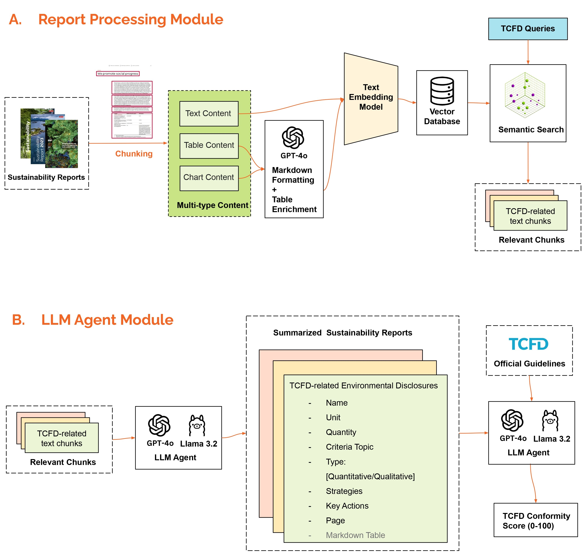

<!-- Framework -->
<br />
<div align="center">
<h1 align="center">Automatic Sustainability Report Analysis</h3>
  <p align="center">
     A framework for automated corporate sustainability report analysis leveraging semantic chunking and table enrichment techniques to improve table and chart content extraction using foundation LLMs.
  </p>
  <a href="https://github.com/ZejieGuo/analyze_sustainability_report_with_ai">
    
  </a>
<div align="left">
  <h3 align="left">Report Processing Module</h3>
  <ol align="left">
    <li>Semantic chunking with Unstructured.io</li>
    <li>Marddown table formatting and table enrichment</li>
    <li>Embedding and semantic search with Pinecone DB</li>
  </ol>
  
  <h3 align="left">LLM Agent Module</h3>
  <ol align="left">
    <li>Disclosure information summary with LLMs</li>
    <li>TCFD conformity assessment or Q&A with LLMs based on disclosure sumamries</li>
  </ol>

<div align="left">
  <h2 align="left">Setup</h3>
  
1. **Clone the GitHub Repository**:
```bash
git clone git@github.com:ZejieGuo/analyze_sustainability_report_with_ai.git
```

2. **Set up and Activate Python Environment**
```bash
python -m venv venv_sustain_ai
```
- Now activate this environment:
```bash
source venv_sustain_ai/bin/activate
```
